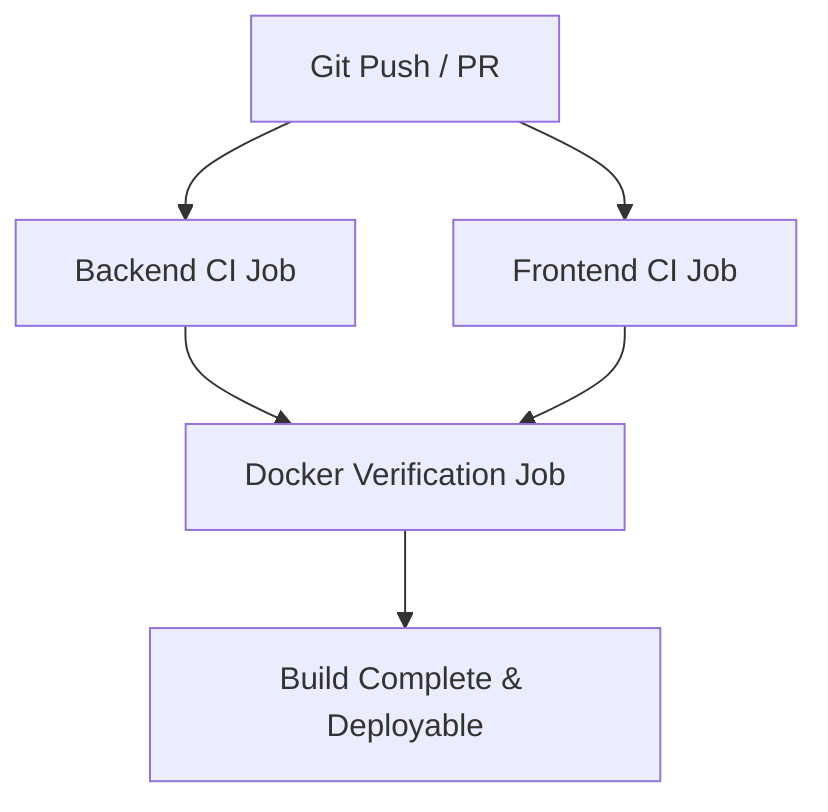

# CI/CD Pipeline Documentation

The RideShare platform features an enterprise-grade, fully automated GitHub Actions CI/CD pipeline defined in [.github/workflows/ci.yml](file:///.github/workflows/ci.yml). This pipeline ensures that every commit, branch merge, and pull request is thoroughly checked, linted, compiled, tested, and validated for Docker compliance before it can be merged into production.

---

## 🛠️ Pipeline Architecture & Job Flow

The pipeline is split into three independent, parallel jobs to maximize build speed, with the Docker build stage acting as the final gating job:

### 1. Backend CI Job (`backend-ci`)
This job isolates backend checks on a standard Linux runner:
*   **Checkout & Node Setup**: Uses standard actions to fetch the code and set up Node 18, configuring NPM package-lock caching to reduce subsequent job runtimes by up to 60%.
*   **Dependency Installation**: Uses `npm ci` for a deterministic, lockfile-locked package installation.
*   **Code Quality (ESLint)**: Audits code syntax using backend ESLint configurations. 
*   **Static Type Checking (tsc)**: Runs TypeScript validation compiler checks with `tsc --noEmit` to catch syntax or signature mismatches.
*   **Jest Test Suite**: Executes the complete Jest integration and unit test suite natively using a virtualized MongoDB memory server (`mongodb-memory-server`), requiring no external database connectivity.

### 2. Frontend CI Job (`frontend-ci`)
Tracks quality across the Next.js App Router workspace:
*   **Deterministic Install**: Installs packages with `npm ci` using lockfile caching.
*   **Next.js Linter**: Assesses code structures for dynamic tags, React hooks dependencies, and accessibility components.
*   **TypeScript Check**: Verifies workspace types using `npm run type-check`.
*   **Production Build Compiler**: Compiles the React codebase into an optimized production-grade static build utilizing the Next.js Compiler (`next build`).

### 3. Docker Verification Job (`docker-verify`)
Triggered immediately after both code checks complete successfully:
*   **Docker Buildx Setup**: Configures high-performance multi-platform builder environments.
*   **Multi-Stage Build Validation**: Verifies that both the Backend Dockerfile and the Frontend Dockerfile build successfully under production targets using GitHub Actions cache overlays (`cache-from`/`cache-to`), guaranteeing error-free deployment.

---

## ⚙️ Trigger Rules

*   **Pushes**: Triggered automatically on all pushes to the `main`, `master`, and `dev` branches.
*   **Pull Requests**: Runs on any incoming Pull Request targeting the branches above.
